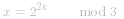

####  概述
我们如何检查一个数是否为 `2` 的幂：`x > 0 and x & (x - 1) == 0`。我们将这个当作已知去解决该问题。

这里有个较为明显的方法去解决它，我们不打算在这里进行讨论。

```python [overview-Python]
class Solution(object):
    def isPowerOfTwo(self, n):
        if n == 0:
            return False
        while n % 4 == 0:
            n /= 4
        return n == 1
```

```java [overview-Java]
class Solution {
  public boolean isPowerOfTwo(int n) {
    if (n == 0) return false;
    while (n % 4 == 0) n /= 4;
    return n == 1;
  }
}
```
我们只讨论   时间复杂度和   空间复杂度的算法。

####  方法一：暴力法 + 预计算
我们提前计算所有可能答案。

我们知道输入的整数是 32 位整数  。因此我们最大 4 的幂次为 ![\[\log_4\left(2^{31}-1\right)\]=15 ](./p___log_4left_2^{31}_-_1right___=_15_.png) ，那么我们总共有 `16` 种可能：*4^0*, *4^1*, *4^2*, ..., *4^{15}*。我们预计算全部可能，然后运行时检查输入数字是否在预计算列表中。

**算法：**

```python [solution1-Python]
class Powers:
    def __init__(self):
        max_power = 15
        self.nums = nums = [1] * (max_power + 1)
        for i in range(1, max_power + 1):
            nums[i] = 4 * nums[i - 1]

class Solution:
    p = Powers()
    def isPowerOfFour(self, num: int) -> bool:
        return num in self.p.nums
```

```java [solution1-Java]
class Powers {
  private int n = 15;
  public List<Integer> nums = new ArrayList();
  Powers() {
    int lastNum = 1;
    nums.add(lastNum);
    for (int i = 1; i < n + 1; ++i) {
      lastNum = lastNum * 4;
      nums.add(lastNum);
    }
  }
}

class Solution {
  public static Powers p = new Powers();
  public boolean isPowerOfFour(int num) {
    return p.nums.contains(num);
  }
}
```

**复杂度分析**

* 时间复杂度：*O(1)*。
* 空间复杂度：*O(1)*。

####  方法二：数学运算
**算法：**
如果数字为 4 的幂 *x = 4^a*，则   应为整数，那么我们检查   是否为偶数就能判断 `x` 是否为 4 的幂。

```python [solution2-Python]
from math import log2
class Solution:
    def isPowerOfFour(self, num: int) -> bool:
        return num > 0 and log2(num) % 2 == 0
```

```java [solution2-Java]
class Solution {
  public boolean isPowerOfFour(int num) {
    return (num > 0) && (Math.log(num) / Math.log(2) % 2 == 0);
  }
}
```

**复杂度分析**

* 时间复杂度：*O(1)*。
* 空间复杂度：*O(1)*。


####  方法三：位操作
**算法：**
- 我们首先检查 `num` 是否为 `2` 的幂：`x > 0 and x & (x - 1) == 0`。
- 现在的问题是区分 `2` 的偶数幂（当 *x* 是 `4` 的幂时）和 `2` 的奇数幂（当 *x* 不是 `4` 的幂时）。在二进制表示中，这两种情况都只有一位为 `1`，其余为 `0`。
- 有什么区别？在第一种情况下（`4` 的幂），`1` 处于偶数位置：第 `0` 位、第 `2` 位、第 `4` 位等；在第二种情况下，`1` 处于奇数位置。
 [在这里插入图片描述](https://pic.leetcode-cn.com/0f9a7930019058316c0e139dc59935b8a10ef6291d2e9fd7b64ff1b09573e016-file_1577945397186)

- 因此 `4` 的幂与数字 *(101010...10)_2* 向与会得到 `0`。即  。
- *(101010...10)_2* 用十六进制表示为 ：*(aaaaaaaa)_{16}*。

```python [solution3-Python]
class Solution:
    def isPowerOfFour(self, num: int) -> bool:
        return num > 0 and num & (num - 1) == 0 and num & 0xaaaaaaaa == 0
```

```java [solution3-Java]
class Solution {
  public boolean isPowerOfFour(int num) {
    return (num > 0) && ((num & (num - 1)) == 0) && ((num & 0xaaaaaaaa) == 0);
  }
}
```

**复杂度分析**

* 时间复杂度：*O(1)*。
* 空间复杂度：*O(1)*。


####  方法四：位运算 + 数学运算
**算法：**
- 我们首先检车 *x* 是否为 `2` 的幂：`x > 0 and x & (x - 1) == 0`。然后可以确定 *x = 2^a*，若 *x* 为 `4` 的幂则 *a* 为偶数。
- 下一步是考虑 *a=2k* 和 *a=2k+1* 两种情况，对 *x* 对 `3` 进行取模：

 

 

- 若 *x* 为 `2` 的幂且 `x%3 == 1`，则 *x* 为 `4` 的幂。
```python [solution1-Python]
class Solution {
class Solution:
    def isPowerOfFour(self, num: int) -> bool:
        return num > 0 and num & (num - 1) == 0 and num % 3 == 1
```

```java [solution1-Java]
class Solution {
  public boolean isPowerOfFour(int num) {
    return (num > 0) && ((num & (num - 1)) == 0) && (num % 3 == 1);
  }
}
```
**工作原理：mod 的计算过程**

我们通过计算   来理解：
- 首先 *2^{2k} = {2^2}^k = 4^k* 且 *4 = 3 + 1*。
- 则 *x* 可以写为  。
- 进行分解： 。
- 且  ，则我们可以变换得  。
- 我们可以继续进行以上操作 *k -> k - 1 -> k - 2 -> ... -> 1* 最后得到  .


**复杂度分析**

* 时间复杂度：*O(1)*。
* 空间复杂度：*O(1)*。