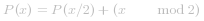
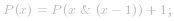

## 总结

本文面向中级用户。本文与以下概念相关: Pop count、最高有效位、最低有效位、最后设置位和动态规划。

## 正文
#### 方法一：Pop count 【通过】

**直觉**

对一个数字解决问题，并应用到全部。

**算法**

本问题可以看做 [位 1 的个数](https://leetcode-cn.com/problems/number-of-1-bits/) 的后续。它计数一个无符号整数的位。结果称为 pop count，或 [汉明权重](https://baike.baidu.com/item/%E6%B1%89%E6%98%8E%E9%87%8D%E9%87%8F/7110799?fr=aladdin)。可以参看 [位 1 的个数](https://leetcode-cn.com/problems/number-of-1-bits/) 的题解以获得更详细介绍。

现在，我们先默认这个概念。假设我们有函数`int popcount(int x)` ，可以返回一个给定非负整数的位计数。我们只需要在 `[0, num]` 范围内循环并将结果存到一个列表中。

```Java [solution 1]
public class Solution {
    public int[] countBits(int num) {
        int[] ans = new int[num + 1];
        for (int i = 0; i <= num; ++i)
            ans[i] = popcount(i);
        return ans;
    }
    private int popcount(int x) {
        int count;
        for (count = 0; x != 0; ++count)
          x &= x - 1; //zeroing out the least significant nonzero bit
        return count;
    }
}
```

**复杂度分析**

* 时间复杂度：*O(nk)*。对于每个整数 *x*，我们需要 *O(k)* 次操作，其中 *k* 是 *x* 的位数。
* 空间复杂度：*O(n)*。 我们需要 *O(n)* 的空间来存储计数结果。如果排除这一点，就只需要常数空间。

----
#### 方法二：动态规划 + 最高有效位 【通过】

**直觉**

利用已有的计数结果来生成新的计数结果。

**算法**

假设有一个整数：

*
x = (1001011101)_2 = (605)_{10}
*

我们已经计算了从 *0* 到 *x - 1* 的全部结果。

我们知道，*x* 与 我们计算过的一个数只有一位之差:

*
x' = (1011101)_2 = (93)_{10}
*

它们只在最高有效位上不同。

让我们以二进制形式检查 *[0, 3]* 的范围：

*
(0) = (0)_2
*

*
(1) = (1)_2
*

*
(2) = (10)_2
*

*
(3) = (11)_2
*

可以看出， 2 和 3 的二进制形式可以通过给 0 和 1 的二进制形式在前面加上 1 来得到。因此，它们的 pop count 只相差 1。

类似的，我们可以使用 *[0, 3]* 作为蓝本来得到 *[4, 7]*。

总之，对于pop count *P(x)*，我们有以下的状态转移函数：

*
P(x + b) = P(x) + 1, b = 2^m > x
*

有了状态转移函数，我们可以利用动态规划从 *0* 开始生成所有结果。


```Java [solution 2]
public class Solution {
    public int[] countBits(int num) {
        int[] ans = new int[num + 1];
        int i = 0, b = 1;
        // [0, b) is calculated
        while (b <= num) {
            // generate [b, 2b) or [b, num) from [0, b)
            while(i < b && i + b <= num){
                ans[i + b] = ans[i] + 1;
                ++i;
            }
            i = 0;   // reset i
            b <<= 1; // b = 2b
        }
        return ans;
    }
}
```

**复杂度分析**

* 时间复杂度：*O(n)*。对每个整数 *x*，我们只需要常数时间。
* 空间复杂度：*O(n)*。我们需要 *O(n)* 的空间来存储技术结果。如果排除这一点，就只需要常数空间。

---

#### 方法三：动态规划 + 最低有效位 【通过】

**直觉**

只要*x'* 小于 *x*，且它们的 pop count 之间存在函数关系，就可以写出其他的状态转移函数。

**算法**

遵循上一方法的相同原则，我们还可以通过最低有效位来获得状态转移函数。

观察*x* 和 *x' = x / 2* 的关系：

*
x = (1001011101)_2 = (605)_{10}
*

*
x' = (100101110)_2 = (302)_{10}
*

可以发现 *x'* 与 *x* 只有一位不同，这是因为*x'* 可以看做 *x* 移除最低有效位的结果。

这样，我们就有了下面的状态转移函数：

 

```Java [solution 3]
public class Solution {
  public int[] countBits(int num) {
      int[] ans = new int[num + 1];
      for (int i = 1; i <= num; ++i)
        ans[i] = ans[i >> 1] + (i & 1); // x / 2 is x >> 1 and x % 2 is x & 1
      return ans;
  }
}
```

**复杂度分析**

* 时间复杂度：*O(n)*。对每个整数 *x*，我们只需要常数时间。
* 空间复杂度：*O(n)*。与方法二相同。

---
#### 方法四：动态规划 + 最后设置位【通过】

**算法**

与上述方法思路相同，我们可以利用最后设置位。

最后设置位是从右到左第一个为1的位。使用 `x &= x - 1` 将该位设置为0，就可以得到以下状态转移函数：

 


```Java [solution 4]
public class Solution {
  public int[] countBits(int num) {
      int[] ans = new int[num + 1];
      for (int i = 1; i <= num; ++i)
        ans[i] = ans[i & (i - 1)] + 1;
      return ans;
  }
}
```


**复杂度分析**

* 时间复杂度：*O(n)*。 与方法三相同。
* 空间复杂度：*(n)*。与方法三相同。
