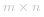

####  方法一：暴力法[超出时间限制]
**算法：**
- 在该方法中，我们尝试在每个方向上都迈出一步，并减少每一步的待执行移动数。无论何时，当我们走出边界且在执行的移动数在合理范围，我们推断，该路径是答案的其中一条路径。
- 为了实现这一点，我们使用了一个递归函数 *findpaths(m,n,N,i,j)*，它将当前移动次数（*N*）和当前位置 *(i，j)* 作为参数，并返回当前移动位置使球出界的可能路径数。 现在，我们向每个方向迈出一步，并更新位置以及当前等待移动的数量。
- 如果我们在任何时刻没有移动，我们返回 0，表示当前移动集不会将球带出边界。 

**复杂度分析**

* 时间复杂度：*O(4^n)*，递归树的大小将为 *4^n*。这里，*n* 表示允许的移动次数。
* 空间复杂度：*O(n)*，递归树的深度可以达到 *n*。 

####  方法二：动态规划[通过] 
**算法：**
- 这种方法的思想是，如果我们能够在 *x* 次移动中到达某个位置，我们可以在 *x+1* 次移动中到达它的所有相邻位置。基于这个想法，我们利用一个二维 *dp* 数组来存储可以到达特定位置的方法的数量。*dp[i][j]* 是指在特定的移动次数下，可达到 *(i,j)* 位置的方式数。 
- 如果当前 *dp* 数组存储了使用 *x-1* 次移动可以达到各种位置的方式的数量，为了确定使用 *x* 移动可以达到位置 *(i,j)* 的方式的数量，我们需要将更新 *dp* 为 *dp[i][j] = dp[i-1][j] + dp[i+1][j] + dp[i][j-1] + dp[i][j+1]* 注意边界条件。因为我们可以从四个相邻位置中的任意一个位置达到位置 *(i,j)* 并且 *x* 次移动中达到指数 *(i,j)* 的总方法数是 *x-1* 移动中达到相邻位置的方法的总和。 
- 如果我们改变 *dp* 数组，有一些情况将对应于 *x-1* 次移动，更新的 dp 将对应于 *x* 移动。因此，我们需要找到解决这个问题的方法。我们使用临时二维数组 *temp* 来存储 *x* 移动的更新结果，而不是更新当前（*x*）移动的 *dp* 数组，使用与 *x-1* 次移动对应的 *dp* 数组获得的结果。在所有位置的所有 dp 都考虑了*x* 移动之后，我们基于 *temp* 更新 *dp* 数组。因此，*dp* 现在包含对应于 *x* 移动的所有情况。 
- 因此，我们首先考虑零移动，我们对其进行初始输入 *dp[x][y]=1*,(*(x,y)* 是初始位置），因为我们只能在零移动中达到这个位置。然后，我们将移动次数增加到 1，并适当地更新所有 *dp*。对于从 1 到 n 的所有可能移动，我们都这样做。
- 为了更新 *count*，它标识出界的路径数，我们只需要在到达边界时执行更新。我们将计数更新为 *count=count+dp[i][j]*，其中 *(i,j)* 对应于其中一个边界。但是，如果 *(i,j)* 同时是多个边界的一部分，我们需要多次添加 *dp[i][j]* 乘以 *(i,j)* 所属的边界数。 
- 在完成所有 *N* 次移动之后，*count* 将给出所需的结果。 

以下动画演示了该过程： 
 [在这里插入图片描述](https://pic.leetcode-cn.com/a8482b76cb7b6f38d6f558bfde45c89faf656c646f2a43c7133de99f11027d71-file_1566978380522)
 [在这里插入图片描述](https://pic.leetcode-cn.com/7ac6884ce2f11677713d29b1bffbd679b3311118f9fb2519559f9adbb890183d-file_1566978380518)
 [在这里插入图片描述](https://pic.leetcode-cn.com/68dd7b8e0c68b0f55f85a1a44cc5d20dbb8e892d540728e3dd6a478414362813-file_1566978380512)
 [在这里插入图片描述](https://pic.leetcode-cn.com/58603abb8b0950412f581284246ea0ea313824482e111cfe2be5a796d9dd5764-file_1566978380515)
 [在这里插入图片描述](https://pic.leetcode-cn.com/4f40ef4d7550fb1371386b80c6c57124d220781190d31f3c9c49b5360dd40e6b-file_1566978380525)
 [在这里插入图片描述](https://pic.leetcode-cn.com/548c75e6d2758f8d4d6b8950704eb5f0323d88605f815ba9b740fbb7fbde7b80-file_1566978380470)
 [在这里插入图片描述](https://pic.leetcode-cn.com/bbb334220ec6d3d5b422b16204a979d4f509e0c16c884e3aa4173e13d01693ba-file_1566978380509)

**复杂度分析**

* 时间复杂度：*O(Nmn)*。我们需要用   次的大小填充 dp 数组。这里   指的是网格的大小，N 指的是可移动的数量。 
* 空间复杂度：*O(m*n)*，使用 *dp* 和 *temp* 数组，大小为  。