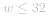

####  方法一：转换成字符串
**算法：**
让我们把给定的数字转换成一个二进制数字串。然后，我们应该简单地检查两个相邻的数字是否相同。 

**复杂度分析**

* 时间复杂度：*O(1)*。对于任意输入，我们执行 *O(w)* 工作，其中 *w* 是 n 中的二进制位数且  。 
* 空间复杂度：*O(1)*，或者 *O(w)*。 

####  方法二：除以2
我们可以通过 `n%2` 和 `n//2` 操作获得最后一位和其余的位。如果最后一位等于剩余的最后一位，那么两个相邻的位具有相同的值，则答案是 `False` 的，反之，答案是 `True` 的。 

**复杂度分析**

* 时间复杂度：*O(1)*。对于任意输入，我们执行 *O(w)* 工作，其中 *w* 是 n 中的二进制位数且  。 
* 空间复杂度：*O(1)*。