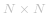

#### 方法 1：深度优先搜索

**算法**

给定的矩阵可以看成图的邻接矩阵。这样我们的问题可以变成无向图连通块的个数。为了方便理解，考虑如下矩阵：

```
M= [1 1 0 0 0 0
    1 1 0 0 0 0
    0 0 1 1 1 0
    0 0 1 1 0 0
    0 0 1 0 1 0
    0 0 0 0 0 1]
```

如果我们把 M 看成图的邻接矩阵，则图为：

 [Friend_Circles](https://pic.leetcode-cn.com/Figures/647_Friend_Circles_1.jpg){:width=500}

在这个图中，点的编号表示矩阵 M 的下标，*i* 和 *j* 之间有一条边当且仅当 *M[i][j]* 为 1。

为了找到连通块的个数，一个简单的方法就是使用深度优先搜索，从每个节点开始，我们使用一个大小为 *N* 的 *visited* 数组（*M* 大小为  ），这样 *visited[i]* 表示第 i 个元素是否被深度优先搜索访问过。

我们首先选择一个节点，访问任一相邻的节点。然后再访问这一节点的任一相邻节点。这样不断遍历到没有未访问的相邻节点时，回溯到之前的节点进行访问。

对于任一图的深度优先搜索如下：

  [1000](https://pic.leetcode-cn.com/Figures/547_Friend_Circles_dfsSlide35.JPG)  [1000](https://pic.leetcode-cn.com/Figures/547_Friend_Circles_dfsSlide36.JPG)  [1000](https://pic.leetcode-cn.com/Figures/547_Friend_Circles_dfsSlide37.JPG)  [1000](https://pic.leetcode-cn.com/Figures/547_Friend_Circles_dfsSlide38.JPG)  [1000](https://pic.leetcode-cn.com/Figures/547_Friend_Circles_dfsSlide39.JPG)  [1000](https://pic.leetcode-cn.com/Figures/547_Friend_Circles_dfsSlide40.JPG)  [1000](https://pic.leetcode-cn.com/Figures/547_Friend_Circles_dfsSlide41.JPG)  [1000](https://pic.leetcode-cn.com/Figures/547_Friend_Circles_dfsSlide42.JPG)  [1000](https://pic.leetcode-cn.com/Figures/547_Friend_Circles_dfsSlide43.JPG)  [1000](https://pic.leetcode-cn.com/Figures/547_Friend_Circles_dfsSlide44.JPG)  [1000](https://pic.leetcode-cn.com/Figures/547_Friend_Circles_dfsSlide45.JPG)  [1000](https://pic.leetcode-cn.com/Figures/547_Friend_Circles_dfsSlide46.JPG)  [1000](https://pic.leetcode-cn.com/Figures/547_Friend_Circles_dfsSlide47.JPG)  [1000](https://pic.leetcode-cn.com/Figures/547_Friend_Circles_dfsSlide48.JPG) 

从图中我们发现，连通块就是可以从任意起点到达的所有节点。

因此，连通块的个数，我们从每个未被访问的节点开始深搜，每开始一次搜索就增加 *count* 计数器一次。

```Java []

public class Solution {
    public void dfs(int[][] M, int[] visited, int i) {
        for (int j = 0; j < M.length; j++) {
            if (M[i][j] == 1 && visited[j] == 0) {
                visited[j] = 1;
                dfs(M, visited, j);
            }
        }
    }
    public int findCircleNum(int[][] M) {
        int[] visited = new int[M.length];
        int count = 0;
        for (int i = 0; i < M.length; i++) {
            if (visited[i] == 0) {
                dfs(M, visited, i);
                count++;
            }
        }
        return count;
    }
}
```


**复杂度分析**

* 时间复杂度：*O(n^2)*，整个矩阵都要被遍历，大小为 *n^2*。
* 空间复杂度：*O(n)*，*visited* 数组的大小。

#### 方法 2：广度优先搜索

**算法**

上面的算法中提到，如果我们把矩阵看成图的邻接矩阵，我们可以使用图算法很快的算出连通块的个数。这可以用到图中的广度优先搜索。

在广度优先搜索中，我们从一个特定点开始，访问所有邻接的节点。然后对于这些邻接节点，我们依然通过访问邻接节点的方式，知道访问所有可以到达的节点。因此，我们按照一层一层的方式访问节点，广搜的例子如下：

  [1000](https://pic.leetcode-cn.com/Figures/547_Friend_Circles_bfsSlide50.JPG)  [1000](https://pic.leetcode-cn.com/Figures/547_Friend_Circles_bfsSlide51.JPG)  [1000](https://pic.leetcode-cn.com/Figures/547_Friend_Circles_bfsSlide52.JPG)  [1000](https://pic.leetcode-cn.com/Figures/547_Friend_Circles_bfsSlide53.JPG)  [1000](https://pic.leetcode-cn.com/Figures/547_Friend_Circles_bfsSlide54.JPG)  [1000](https://pic.leetcode-cn.com/Figures/547_Friend_Circles_bfsSlide55.JPG)  [1000](https://pic.leetcode-cn.com/Figures/547_Friend_Circles_bfsSlide56.JPG)  [1000](https://pic.leetcode-cn.com/Figures/547_Friend_Circles_bfsSlide57.JPG)  [1000](https://pic.leetcode-cn.com/Figures/547_Friend_Circles_bfsSlide58.JPG)  [1000](https://pic.leetcode-cn.com/Figures/547_Friend_Circles_bfsSlide59.JPG)  [1000](https://pic.leetcode-cn.com/Figures/547_Friend_Circles_bfsSlide60.JPG)  [1000](https://pic.leetcode-cn.com/Figures/547_Friend_Circles_bfsSlide61.JPG)  [1000](https://pic.leetcode-cn.com/Figures/547_Friend_Circles_bfsSlide62.JPG) 

在这个例子中，我们从任一个节点开始广搜，使用 *visited* 数组记录是否被访问过。增加 *count* 变量当一个连通块已经访问完但是还有节点没有被访问的时候。

```Java []
public class Solution {
    public int findCircleNum(int[][] M) {
        int[] visited = new int[M.length];
        int count = 0;
        Queue < Integer > queue = new LinkedList < > ();
        for (int i = 0; i < M.length; i++) {
            if (visited[i] == 0) {
                queue.add(i);
                while (!queue.isEmpty()) {
                    int s = queue.remove();
                    visited[s] = 1;
                    for (int j = 0; j < M.length; j++) {
                        if (M[s][j] == 1 && visited[j] == 0)
                            queue.add(j);
                    }
                }
                count++;
            }
        }
        return count;
    }
}
```

**复杂度分析**

* 时间复杂度：*O(n^2)*，整个矩阵都要被访问。
* 空间复杂度：*O(n)*，*queue* 和 *visited* 数组的大小。


#### 方法 3：并查集

另一种统计图中连通块数量的方法是使用并查集。方法很简单。

使用一个大小为 *N* 的 *parent* 数组，遍历这个图，每个节点我们都遍历所有相邻点，并让相邻点指向它，并设置成一个由 *parent* 节点决定的单独组。这个过程被称为 *union*。这样每个组都有一个唯一的 *parent* 节点，这些节点的父亲为 -1。

对于每对新节点，我们找寻他们的父亲。如果父亲节点一样，那么什么都不做他们已经是一个组里。如果父亲不同，说明他们仍然需要合并。因此，将他们的父亲合并，也就是 ![parent\big\[parent\[x\]\big\]=parent\[y\] ](./p__parentbig_parent_x_big_=parent_y__.png) ，这样就让他们在一个组里了。

下面是一个简单的模拟：

  [1000](https://pic.leetcode-cn.com/Figures/547_Friend_Circles_dfsSlide35.JPG)  [1000](https://pic.leetcode-cn.com/Figures/547_Friend_Circles_dfsSlide36.JPG)  [1000](https://pic.leetcode-cn.com/Figures/547_Friend_Circles_dfsSlide37.JPG)  [1000](https://pic.leetcode-cn.com/Figures/547_Friend_Circles_dfsSlide38.JPG)  [1000](https://pic.leetcode-cn.com/Figures/547_Friend_Circles_dfsSlide39.JPG)  [1000](https://pic.leetcode-cn.com/Figures/547_Friend_Circles_dfsSlide40.JPG)  [1000](https://pic.leetcode-cn.com/Figures/547_Friend_Circles_dfsSlide41.JPG)  [1000](https://pic.leetcode-cn.com/Figures/547_Friend_Circles_dfsSlide42.JPG)  [1000](https://pic.leetcode-cn.com/Figures/547_Friend_Circles_dfsSlide43.JPG)  [1000](https://pic.leetcode-cn.com/Figures/547_Friend_Circles_dfsSlide44.JPG)  [1000](https://pic.leetcode-cn.com/Figures/547_Friend_Circles_dfsSlide45.JPG)  [1000](https://pic.leetcode-cn.com/Figures/547_Friend_Circles_dfsSlide46.JPG)  [1000](https://pic.leetcode-cn.com/Figures/547_Friend_Circles_dfsSlide47.JPG)  [1000](https://pic.leetcode-cn.com/Figures/547_Friend_Circles_dfsSlide48.JPG) 


最后，找到组的个数，也就是根节点的个数。这些节点应该是 *parent* 信息为 -1。

```Java []
public class Solution {
    int find(int parent[], int i) {
        if (parent[i] == -1)
            return i;
        return find(parent, parent[i]);
    }

    void union(int parent[], int x, int y) {
        int xset = find(parent, x);
        int yset = find(parent, y);
        if (xset != yset)
            parent[xset] = yset;
    }
    public int findCircleNum(int[][] M) {
        int[] parent = new int[M.length];
        Arrays.fill(parent, -1);
        for (int i = 0; i < M.length; i++) {
            for (int j = 0; j < M.length; j++) {
                if (M[i][j] == 1 && i != j) {
                    union(parent, i, j);
                }
            }
        }
        int count = 0;
        for (int i = 0; i < parent.length; i++) {
            if (parent[i] == -1)
                count++;
        }
        return count;
    }
}
```

**复杂度分析**

* 时间复杂度：*O(n^3)*，访问整个矩阵一次，并查集操作需要最坏 *O(n)* 的时间。
* 空间复杂度：*O(n)*，*parent* 大小为 *n*。
