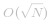

#### 方法一：枚举

我们枚举 `n` 的所有因数，并计算它们的和。

在枚举时，我们只需要从 `1` 到 `sqrt(n)` 进行枚举即可。这是因为如果 `n` 有一个大于 `sqrt(n)` 的因数 `x`，那么它一定有一个小于 `sqrt(n)` 的因数 `n/x`。因此我们可以从 `1` 到 `sqrt(n)` 枚举 `n` 的因数，当出现一个 `n` 的因数 `x` 时，我们还需要算上 `n/x`。此外还需要考虑特殊情况，即 `x = n/x`，这时我们不能重复计算。

在求出 `n` 的所有因数之和 `sum` 后，由于 `sum` 包含了 `n` 本身，因此我们只需要判断 `sum == n * 2` 即可。

```Java [sol1]
class Solution {
    public boolean checkPerfectNumber(int num) {
        if (num <= 0) {
            return false;
        }
        int sum = 0;
        for (int i = 1; i * i <= num; i++) {
            if (num % i == 0) {
                sum += i;
                if (i * i != num) {
                    sum += num / i;
                }

            }
        }
        return sum - num == num;
    }
}
```

**复杂度分析**

* 时间复杂度： 。

* 空间复杂度：*O(1)*。

#### 方法二：欧几里得-欧拉定理

欧几里得-欧拉定理告诉我们，每个偶完全数都可以写成 *2^{p-1}(2^p-1)* 的形式，其中 *p* 为素数。例如前四个完全数可以写成如下形式：

```
6 = 2^1 * (2^2 - 1)
28 = 2^2 * (2^3 - 1)
496 = 2^3 * (2^4 - 1)
8128 = 2^4 * (2^5 - 1)
```

由于目前奇完全数还未被发现，因此所有的完全数都可以写成上述形式。当 `n` 不超过 `10^8` 时，`p` 也不会很大，因此我们只要带入最小的若干个素数 `2, 3, 5, 7, 13, 17, 19, 31)`，将不超过 `10^8` 的所有完全数计算出来即可。

```Java [sol2]
public class Solution {
    public int pn(int p) {
        return (1 << (p - 1)) * ((1 << p) - 1);
    }
    public boolean checkPerfectNumber(int num) {
        int[] primes=new int[]{2,3,5,7,13,17,19,31};
        for (int prime: primes) {
            if (pn(prime) == num)
                return true;
        }
        return false;
    }
}
```

**复杂度分析**

* 时间复杂度：*O(1)*。

* 空间复杂度：*O(1)*。