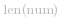
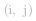
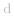

##  解决方法：
####  方法一：暴力法
数字最多只有 8 位，因此只有 28 个可用的互换。

**算法：**
- 我们将数字存储为长度为   的列表。对于位置为   的每个候选交换，我们交换数字并记录组成的新数字是否大于当前答案，然后交换回来恢复原始数字。
- 唯一的细节可能是检查我们没有引入前导零。我们实际上不需要检查它，因为我们的原始数据没有。

**复杂度分析**

* 时间复杂度：*O(N^3)*。其中 *N* 是输入数字的总位数。对于每对数字，我们最多花费 *O(N)* 的时间来比较最后的序列。 
* 空间复杂度：*O(N)*，存储在   中的信息。

####  方法二：贪心算法
**算法：**
- 我们将计算 ![\text{last\[d\]=i} ](./p__text{last_d__=_i}_.png) ，最后一次出现的数字  （如果存在）的索引  。             
-  然后，从左到右扫描数字时，如果将来有较大的数字，我们将用最大的数字交换；如果有多个这样的数字，我们将用最开始遇到的数字交换。 

**复杂度分析**

* 时间复杂度：*O(N)*。其中，*N* 是输入数字的总位数。每个数字最多只考虑一次。 
* 空间复杂度：*O(1)*，  使用的额外空间最多只有 10 个。