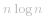

#### 方法 1：暴力

**算法**

在暴力方法中，我们考虑 *nums* 数组中每一个可能的子序列。对于每一个子序列 *nums[i:j]* ，我们检查它是否是最小的无序子序列。因此对于每一个子序列，我们求出这个子序列中的最大和最小值，并分别用 *max* 和 *min* 表示。

如果子序列 *nums[0:i-1]* 和 *nums[j:n-1]* 是升序的，那么仅有 *nums[i:j]* 是可能的子序列。更进一步， *nums[0:i-1]* 中所有的元素都要比 *min* 小且 *nums[j:n-1]* 中所有的元素都要比 *max* 大。我们对于枚举的每一对 *i* 和 *j* 都做这样的检查。

接下来，我们需要检查 *nums[0:i-1]* 和 *nums[j:n-1]* 是否是升序的。如果上述所有条件都满足，我们通过枚举所有的 i 和 j 并计算 *j-i* 来找到最短的无序子数组。

```Java []
public class Solution {
    public int findUnsortedSubarray(int[] nums) {
        int res = nums.length;
        for (int i = 0; i < nums.length; i++) {
            for (int j = i; j <= nums.length; j++) {
                int min = Integer.MAX_VALUE, max = Integer.MIN_VALUE, prev = Integer.MIN_VALUE;
                for (int k = i; k < j; k++) {
                    min = Math.min(min, nums[k]);
                    max = Math.max(max, nums[k]);
                }
                if ((i > 0 && nums[i - 1] > min) || (j < nums.length && nums[j] < max))
                    continue;
                int k = 0;
                while (k < i && prev <= nums[k]) {
                    prev = nums[k];
                    k++;
                }
                if (k != i)
                    continue;
                k = j;
                while (k < nums.length && prev <= nums[k]) {
                    prev = nums[k];
                    k++;
                }
                if (k == nums.length) {
                    res = Math.min(res, j - i);

                }
            }
        }
        return res;
    }
}
```

**复杂度分析**

* 时间复杂度：*O(n^3)* 。使用了三重循环。

* 空间复杂度：*O(1)* 。只使用了常数空间。

#### 方法 2：更好的暴力

**算法**

在这种方法中，我们基于选择排序使用如下想法：我们遍历 *nums* 数组中的每一个元素 *nums[i]* 。对于每一个元素，我们尝试找到它在正确顺序数组中的位置，即将它与每一个满足 *i < j < n* 的 *nums[j]* 做比较，这里 *n* 是 *nums* 数组的长度。

如果存在 *nums[j]* 比 *nums[i]* 小，这意味着 *nums[i]* 和 *nums[j]* 都不在排序后数组中的正确位置。因此我们需要交换这两个元素使它们到正确的位置上。但这里我们并不需要真的交换两个元素，我们只需要标记两个元素在原数组中的位置 *i* 和 *j* 。这两个元素标记着目前无序数组的边界。

因此，在所有的 *nums[i]* 中，我们找到最左边不在正确位置的 *nums[i]* ，这标记了最短无序子数组的左边界（*l*）。类似的，我们找到最右边不在正确位置的边界 *nums[j]* ，它标记了最短无序子数组的右边界 (*r*) 。

 [image.png](https://pic.leetcode-cn.com/78a1cebc4d1310e97c9bc201293d4a376d05cc7d3142b7794453332adf3ead14-image.png){:width=500}


因此，我们可以求得最短无序子数组的长度为 *r - l + 1* 。

```Java []
public class Solution {
    public int findUnsortedSubarray(int[] nums) {
        int l = nums.length, r = 0;
        for (int i = 0; i < nums.length - 1; i++) {
            for (int j = i + 1; j < nums.length; j++) {
                if (nums[j] < nums[i]) {
                    r = Math.max(r, j);
                    l = Math.min(l, i);
                }
            }
        }
        return r - l < 0 ? 0 : r - l + 1;
    }
}
```

**复杂度分析**

* 时间复杂度：*O(n^2)* 。使用了两重循环。

* 空间复杂度：*O(1)* 。只使用了常数空间。

#### 方法 3：排序

**算法**

另一个简单的想法是：我们将数组 *nums* 进行排序，记为   。然后我们比较 *nums* 和   的元素来决定最左边和最右边不匹配的元素。它们之间的子数组就是要求的最短无序子数组。

```Java []
public class Solution {
    public int findUnsortedSubarray(int[] nums) {
        int[] snums = nums.clone();
        Arrays.sort(snums);
        int start = snums.length, end = 0;
        for (int i = 0; i < snums.length; i++) {
            if (snums[i] != nums[i]) {
                start = Math.min(start, i);
                end = Math.max(end, i);
            }
        }
        return (end - start >= 0 ? end - start + 1 : 0);
    }
}
```

**复杂度分析**

* 时间复杂度：  。排序消耗   的时间。

* 空间复杂度：*O(n)* 。我们拷贝了一份原数组来进行排序。

#### 方法 4：使用栈

**算法**

这个方法背后的想法仍然是选择排序。我们需要找到无序子数组中最小元素和最大元素分别对应的正确位置，来求得我们想要的无序子数组的边界。

为了达到这一目的，此方法中，我们使用 *栈* 。我们从头遍历 *nums* 数组，如果遇到的数字大小一直是升序的，我们就不断把对应的下标压入栈中，这么做的目的是因为这些元素在目前都是处于正确的位置上。一旦我们遇到前面的数比后面的数大，也就是 *nums[j]* 比栈顶元素小，我们可以知道 *nums[j]* 一定不在正确的位置上。

为了找到 *nums[j]* 的正确位置，我们不断将栈顶元素弹出，直到栈顶元素比 *nums[j]* 小，我们假设栈顶元素对应的下标为 *k* ，那么我们知道 *nums[j]* 的正确位置下标应该是 *k + 1* 。

我们重复这一过程并遍历完整个数组，这样我们可以找到最小的 *k*， 它也是无序子数组的左边界。

类似的，我们逆序遍历一遍 *nums* 数组来找到无序子数组的右边界。这一次我们将降序的元素压入栈中，如果遇到一个升序的元素，我们像上面所述的方法一样不断将栈顶元素弹出，直到找到一个更大的元素，以此找到无序子数组的右边界。

我们可以看下图作为参考。我们观察到上升还是下降决定了相对顺序，我们还可以观察到指针 *b* 在下标 0 后面标记着无序子数组的左边界，指针 *a* 在下标 7 前面标记着无序子数组的右边界。

 [image.png](https://pic.leetcode-cn.com/5c6b77b2f1cf11fbd4607ed0b407d25e1fb76eaef1486fd3cd3292ced9829e6e-image.png){:width=500}


下面的代码由 [@fallcreek](http://leetcode.com/fallcreek) 提供。

```Java []
public class Solution {
    public int findUnsortedSubarray(int[] nums) {
        Stack < Integer > stack = new Stack < Integer > ();
        int l = nums.length, r = 0;
        for (int i = 0; i < nums.length; i++) {
            while (!stack.isEmpty() && nums[stack.peek()] > nums[i])
                l = Math.min(l, stack.pop());
            stack.push(i);
        }
        stack.clear();
        for (int i = nums.length - 1; i >= 0; i--) {
            while (!stack.isEmpty() && nums[stack.peek()] < nums[i])
                r = Math.max(r, stack.pop());
            stack.push(i);
        }
        return r - l > 0 ? r - l + 1 : 0;
    }
}
```

**复杂度分析**

* 时间复杂度：*O(n)*。需要遍历数组一遍，栈的时间复杂度也为 *O(n)*。

* 空间复杂度：*O(n)*。栈的大小最大达到 *n*。

#### 方法 5：不使用额外空间

**算法**

这个算法背后的思想是无序子数组中最小元素的正确位置可以决定左边界，最大元素的正确位置可以决定右边界。

因此，首先我们需要找到原数组在哪个位置开始不是升序的。我们从头开始遍历数组，一旦遇到降序的元素，我们记录最小元素为 *min* 。

类似的，我们逆序扫描数组 *nums*，当数组出现升序的时候，我们记录最大元素为 *max*。

然后，我们再次遍历 *nums* 数组并通过与其他元素进行比较，来找到 *min* 和 *max* 在原数组中的正确位置。我们只需要从头开始找到第一个大于 *min* 的元素，从尾开始找到第一个小于 *max* 的元素，它们之间就是最短无序子数组。

我们可以再次使用下图作为说明：

 [image.png](https://pic.leetcode-cn.com/61276ef77b0f1338b09332c278ad2751874b9bbc36161be9a7de9c974b1de859-image.png){:width=500}


我们观察到指针 *b* 在下标 0 以后，标记着无序子数组的左边界，指针 *a* 在下标 7 以前，标记着无序子数组的右边界。

```Java []
public class Solution {
    public int findUnsortedSubarray(int[] nums) {
        int min = Integer.MAX_VALUE, max = Integer.MIN_VALUE;
        boolean flag = false;
        for (int i = 1; i < nums.length; i++) {
            if (nums[i] < nums[i - 1])
                flag = true;
            if (flag)
                min = Math.min(min, nums[i]);
        }
        flag = false;
        for (int i = nums.length - 2; i >= 0; i--) {
            if (nums[i] > nums[i + 1])
                flag = true;
            if (flag)
                max = Math.max(max, nums[i]);
        }
        int l, r;
        for (l = 0; l < nums.length; l++) {
            if (min < nums[l])
                break;
        }
        for (r = nums.length - 1; r >= 0; r--) {
            if (max > nums[r])
                break;
        }
        return r - l < 0 ? 0 : r - l + 1;
    }
}
```

**复杂度分析**

* 时间复杂度：*O(n)*。使用了 4 个 *O(n)* 的循环。

* 空间复杂度：*O(1)*。使用了常数空间。
